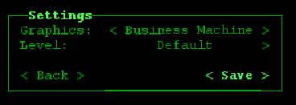
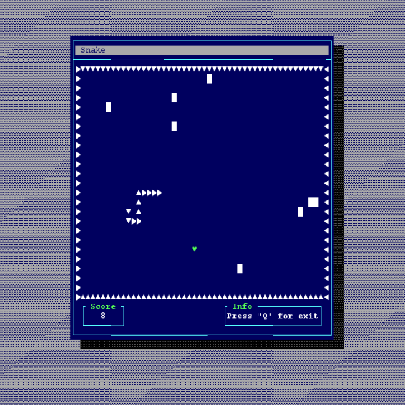
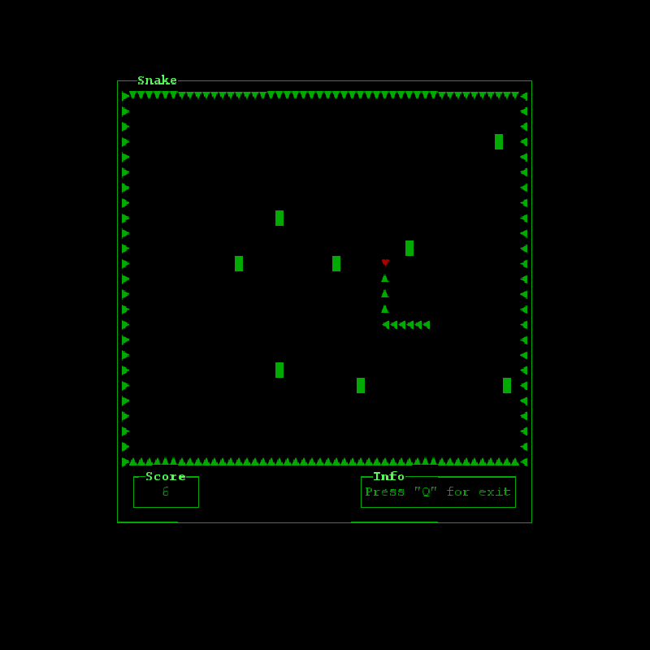
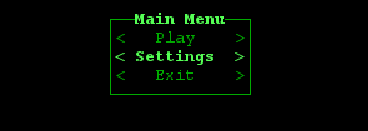

# Console Snake Game

## Description
This project is a classic "Snake" game written in Java using the Google Lanterna library to create a console interface.

I am currently continuing my self-study and plan to rewrite this project in a couple of months to assess my progress.

## About the Project
There was no ready-made component for a "switch button" in the Google Lanterna library, so I had to implement my own.

Also, in the game, you can choose a theme. I took standard themes from the library and added styles for my components.

### Difficulty Selection
In the game, you can choose the difficulty level:
- **With obstacles** - obstacles will be placed on the game field that you need to avoid.
- **Without obstacles** - there are no obstacles on the game field, only the snake and food.
A few more images of the project:

### Requirements
- Java 9 or higher
- Maven

## Usage
After launching the game, use the following keys to control the snake:
- **Arrow Up** - move up
- **Arrow Left** - move left
- **Arrow Down** - move down
- **Arrow Right** - move right

The goal of the game is to eat food that appears on the field to increase the length of the snake. The game ends if the snake hits a wall, obstacle, or itself.
